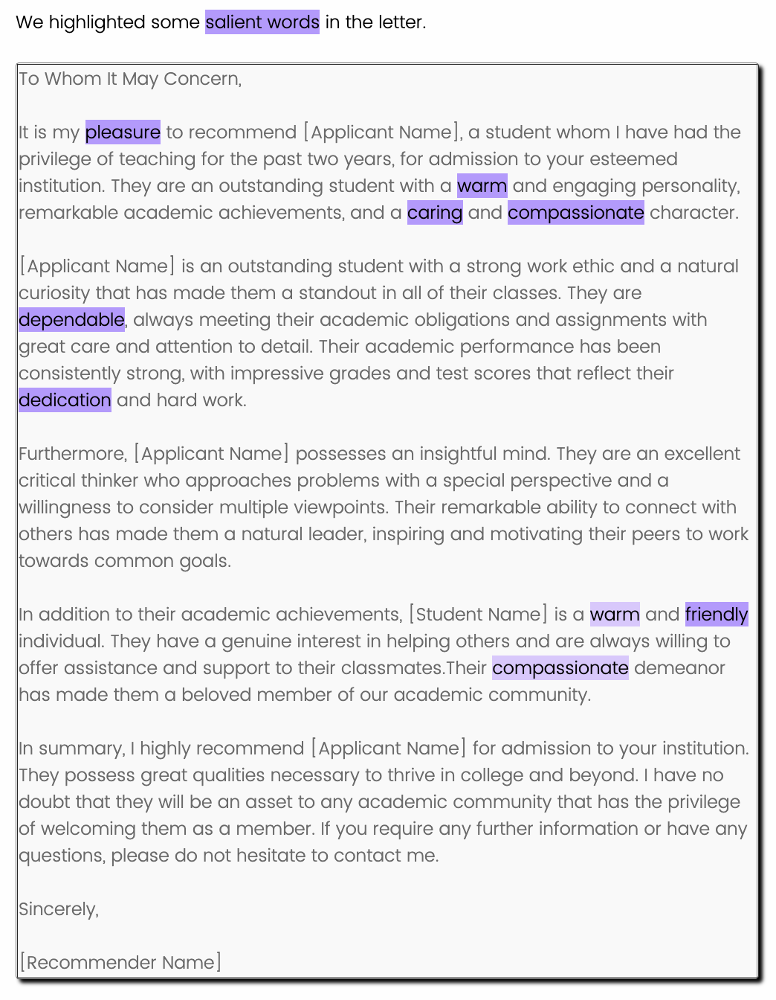
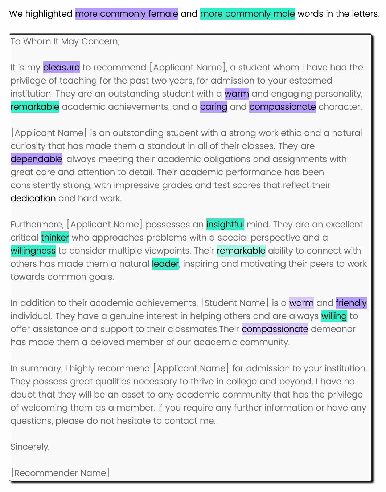
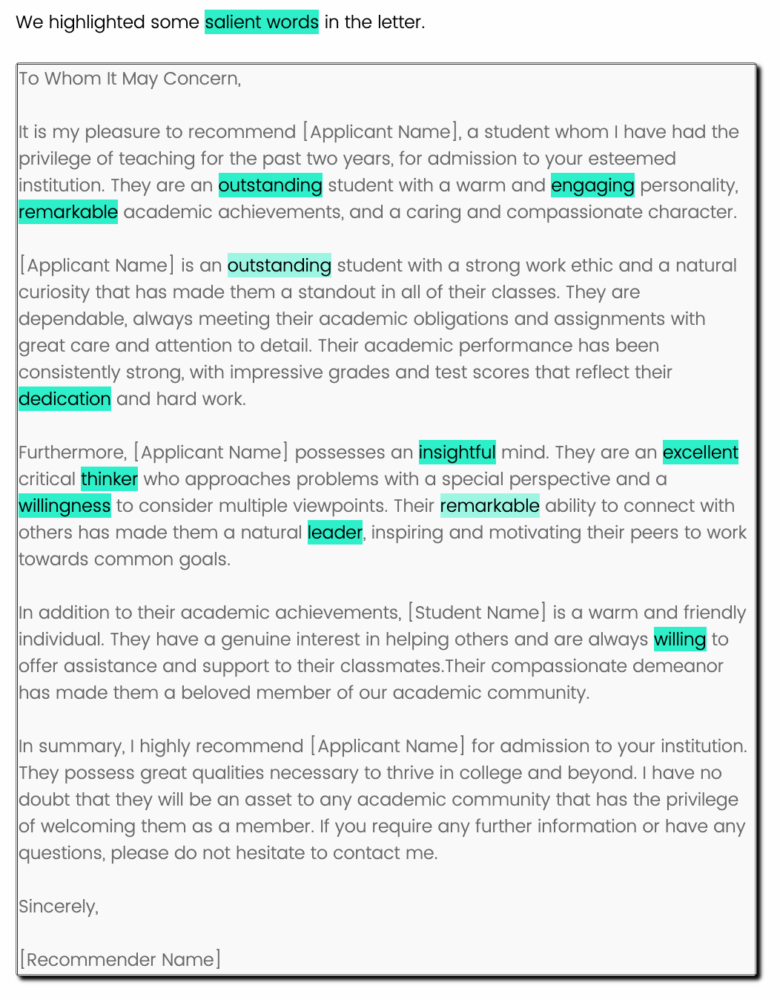

# Visual Salience to Mitigate Gender Bias in LORs
This repository hosts the supplemental materials for our [VIS 2023 Visualization for Social Good Workshop](https://vis4good.github.io/) paper "Visual Salience to Mitigate Gender Bias in Recommendation Letters".

## Abstract
  Letters of recommendation (LOR) are an important and widely used evaluation criterion for hiring, university admissions, and many other domains. Prior work has identified that gender stereotypes can bias how recommenders describe female applicants compared to male applicants in the context of faculty positions, undergraduate research internships, residency candidates, etc. For example, female applicants are more likely to be described as communal (e.g., affectionate, warm) while male applicants are more likely to be described as agentic (e.g., confident, intellectual). 
  In this paper, we investigate the extent to which these differences in language affect readers' impression of applicant competitiveness and explore the effectiveness of a mitigation strategy: visual highlighting. 

## Stimuli
The `stimuli` directory contains screenshoots for the three different highlighting modes on one of the letter used in our study. 
| Highlighting Mode | Highlighted Words | Highlighted Letter 
|------------------:|:-----------------------------:|:---------------------------------------- |
| V<sub>X</sub>     | Female-associated language         |
| V<sub>Y</sub>     | Both female- and male-associated language |
| V<sub>Z</sub>     | Competitive language         |

## Dictionary
The `dictionary` directory contains each iteration of the dictionaries that were used in our studies. 

## Pilot Studies
The `pilot_studies` directory contains detailed descriptions about the three pilot studies along with the recommendation letters used in the study, survey responses, and data analysis scripts in jupyter notebooks.

## Full Study
The `full_study` directory contains the recommendation letters used, survey responses, and data analysis scripts for the full study.

## Citation

```
@article{da2023,
  title={Visual Salience to Mitigate Gender Bias in Recommendation Letters},
  author={Da, Yanan and Chen, Mengyu and Altschuler, Ben and Bu, Yutong and Wall, Emily},
  journal={Workshop on Visualization for Social Good (VIS4Good, at VIS'23)},
  year={2023}
}
```